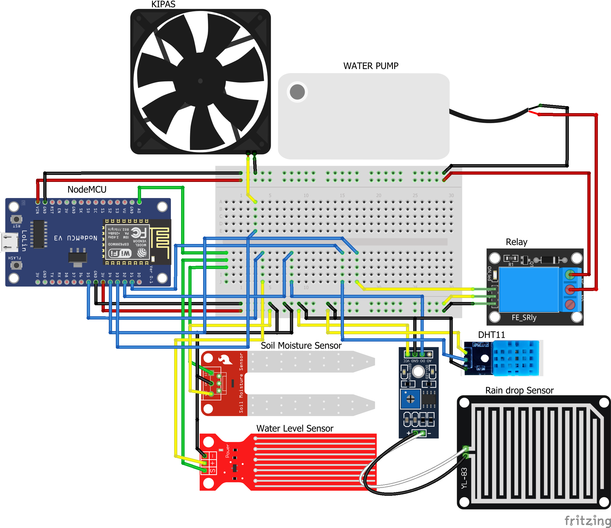

# Smart Garden IoT System

## Overview

This is an IoT (Internet of Things) project for a Smart Garden System that utilizes an ESP8266 microcontroller to monitor and control various aspects of a garden, including soil moisture, tank water level, and temperature. The system connects to the Blynk platform to provide remote monitoring and control via a mobile app.



## Features

- Monitor soil moisture levels.
- Check the water tank's water level.
- Measure temperature and humidity.
- Control a water pump and a fan.
- Receive alerts and notifications based on sensor readings.
- Remotely monitor your garden using the Blynk app.

## Hardware Requirements

- ESP8266 microcontroller.
- DHT11 sensor for temperature and humidity.
- Soil moisture sensor.
- Water level sensor.
- Relay modules.
- Water pump and fan.
- Blynk app for remote monitoring and control.

## Getting Started

1. Clone this repository to your local machine:

```bash
git clone https://github.com/Dityaren/Smart-Garden-IoT-System
```

2. Modify the `auth`, `ssid`, and `pass` variables in the code with your Blynk authentication key and Wi-Fi credentials.

3. Upload the code to your ESP8266 microcontroller using the Arduino IDE or other compatible development tools.

4. Connect the required sensors and actuators to the appropriate GPIO pins on your ESP8266.

5. Power up your ESP8266 and start monitoring your garden through the Blynk app.

## Usage

- The system will continuously monitor the soil moisture level, water tank level, and temperature and humidity.
- The water pump and fan will be controlled based on sensor readings.
- You will receive notifications and alerts on the Blynk app.
- Monitor and control your garden remotely from anywhere using the Blynk app.

## Contributing

Contributions are welcome. Feel free to submit issues, feature requests, or pull requests.

## License

This project is licensed under the GNU GPL v3 - see the [LICENSE](LICENSE) file for details.

## Acknowledgments

- Special thanks to the Blynk community for their IoT platform.
- Inspiration for this project comes from the need for efficient garden monitoring and maintenance.
